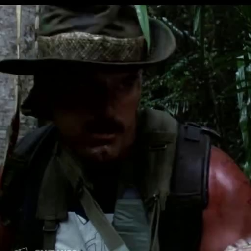

# Human face generation

<details>
<summary><strong>Dataset: CelebV-HQ</strong></summary>


github link: https://github.com/CelebV-HQ/CelebV-HQ

- In order to generate human face images that follows the data distribution of CelebV-HQ,  we need to create a generative model from scratch or finetune the existing scalable pretrained network on human face benchmarks such as FFHQ.

```python
# Download from the shared preprocessed video at github issues: https://github.com/CelebV-HQ/CelebV-HQ/issues/8
curl -L \
"https://drive.usercontent.google.com/download?id=1lfCZha3ZbxCxY3BUDnxwoyyvyuBd029t&export=download&confirm=t" \
-o dataset.tar.gz
# extract a .tzr.gz archive
pv dataset.tar.gz | tar -xzf -
```

- Extracting a frame from each video

Sampled frames from each video at a fixed interval and applied MediaPipe Face Detection, retaining only frames with exactly one detected face. Candidate frames were ranked by detection confidence, and the highest-confidence frame (top-1) was selected from each video to construct a cleaner face image dataset for training a generative model that better reflects the target data distribution. 

Note. some faces are not detected through MediaPipe Face Detection (Followings are the example - total 686 videos among 35666 videos)

<table>
<tr>
<td></td>
<td></td>
<td></td>
</tr>
</table>


</details>

<details>
<summary><strong>StyleGAN architecture</strong></summary>


- Original Generative Adversarial Network (GAN) is composed of a generator $G$ and a discriminator $D$, trained through the minimax objective:
    
    $\min_G \max_D V(D,G)\mathbb{E}_{x \sim p_{\text{data}}}[\log D(x)]
    +
    \mathbb{E}_{z \sim p(z)}[\log(1 - D(G(z)))].$
    
    The generator learns to map a latent vector $z$ to realistic images, while the discriminator learns to distinguish real samples from generated ones.
    
- While the original GAN generator synthesizes images directly from a latent vector $z$, StyleGAN introduces a mapping network $z \rightarrow w$ and injects style information into every layer through Adaptive Instance Normalization (AdaIN). AdaIN first normalizes the feature statistics of a convolutional layer and then modulates them using layer-specific affine transformations of $w$, localizing the effect of each style to a particular layer. Combined with the generator's coarse-to-fine architecture, this encourages early layers to control high-level attributes such as pose and face shape, while later layers specialize in fine details and textures. StyleGAN further injects independent noise into each layer, enabling stochastic variation such as skin pores, freckles, and individual hair placement, relieving the latent code from having to encode both global structure and fine local randomness simultaneously.


</details>

<details>
<summary><strong>StyleGAN2 architecture</strong></summary>


- StyleGAN2 revisited the StyleGAN architecture and removed AdaIN, replacing it with weight modulation and demodulation inside each convolution layer. In StyleGAN, injected noise influenced the feature statistics used by AdaIN, causing local stochastic variations to affect global normalization and leading to characteristic droplet-like artifacts. By moving style control from activation normalization to modulated convolutions, StyleGAN2 prevents noise amplification, preserves local stochastic effects, simplifies the generator architecture, and improves image quality.
- StyleGAN2 removed progressive growing and instead trained the full-resolution network from the beginning. To preserve coarse-to-fine image synthesis, the generator uses skip connections that convert features at each resolution to RGB and sum them into the final image, while the discriminator adopts a residual architecture. This design retains the hierarchical generation process without requiring layers to be added during training. In progressive growing, the generator and discriminator repeatedly change their structure as new resolution blocks are introduced, causing shifts in the learned feature representations and encouraging certain visual features to become tied to specific resolutions. These effects can manifest as phase artifacts, distorted spatial relationships, and other characteristic image artifacts. By keeping the network architecture fixed throughout training, StyleGAN2 achieves more stable optimization, smoother latent-space behavior (lower PPL), and improved image quality (lower FID).
- projection of images to latent space:


</details>

<details>
<summary><strong>StyleGAN2-ada (adaptive discriminator augmentation)</strong></summary>


github link: https://github.com/nvlabs/stylegan2-ada-pytorch

### Processing the dataset

```python
# crop and resize to 256x256 image
python dataset_tool.py --source=/workspace/data/processed_img_big --dest=/workspace/data/celebvhq-big --width=256 --height=256 --transform=center-crop --resize-filter=box
# make .zip
python dataset_tool.py --source=/workspace/data/celebvhq-big --dest=/scratch/datasets/celebvhq-big.zip
```

### Training the model (additionally train from the checkpoint)

```python
# transfer learning from ffhq256 pretrained model
python [train.py](http://train.py/) --outdir=/scratch/training-runs --data=/scratch/datasets/styleganv2_celebv_hq.zip --gpus=8 --resume=ffhq256 --snap=10 --aug=ada --target=0.6 --augpipe=blit --kimg=10000
```

```python
# learning from scratch
python [train.py](http://train.py/) --outdir=/scratch/training-runs --data=/scratch/datasets/celebvhq-big.zip --gpus=8 --snap=10 --aug=ada --target=0.6 --augpipe=blit --kimg=10000
```

- I later realized that the pretrained model on ffhq256 was not a perfect human face generator. (images at below shows unrealistic images) ⇒ It could be meaningful to see pretrained model’s generation quality before doing transfer learning


- can we generate images that corresponds to the train images? → no, there’s no explicit mapping between the training image and the latent z (so there’s another area called GAN inversion; generative models that uses VAE architectures has mapping)

### Sampling 1000 images

- It is common in GAN literature to report the seed and truncation value for reproduceable sampling.
- seeds: seed for setting random state as `np.random.RandomState(seed)` and use it for sampling the generator’s latent from a univariate “normal” (Gaussian) distribution of mean 0 and variance 1.
- truncation psi: modifying the intermediate latent $w=f(z)$ to $w'=\bar w + \psi(w-\bar w)$, which is moving the intermediate latent closer to its fixed average at sampling time; the purpose of modification is to gain higher visual quality and realism, sacrificing diversity. (we can check the “average image” using $\bar w$ by setting the truncation $\psi$=0.0)

```python
python generate.py --outdir=thousand --trunc=1 --seeds=1-1000 \
    --network=/scratch/training-runs/00000-styleganv2_celebv_hq-auto8-kimg10000-ada-target0.6-blit-resumeffhq256/network-snapshot-009999.pkl
```


</details>

<details>
<summary><strong>StyleGAN3</strong></summary>


### Training the model (additionally train from the checkpoint)

```python
# transfer learning from ffhq256 pretrained model
python [train.py](http://train.py/) --outdir=/scratch/training-runs --data=/scratch/datasets/celebvhq_keyframes15000.zip \
--cfg=stylegan3-t --gpus=8 --batch=64 --gamma=2 --snap=10 --aug=noaug --kimg=5000 --cbase=16384 \ # gamma 6.6
--resume=https://api.ngc.nvidia.com/v2/models/nvidia/research/stylegan3/versions/1/files/stylegan3-t-ffhqu-256x256.pkl
```

### Sampling

```python
# Generate an image using pre-trained AFHQv2 model ("Ours" in Figure 1, left).
python gen_images.py --outdir=thousand --trunc=1 --seeds=1-1000 \
    --network=/scratch/training-runs/(checkpoint)
```


</details>

<details>
<summary><strong>Experiment</strong></summary>


1. StyleGAN2-ada

```python
python train.py --outdir=/scratch/training-runs --data=/scratch/datasets/celebvhq-available.zip --gpus=8 --resume=ffhq256 --snap=10 --aug=ada --target=0.6 --augpipe=blit --kimg=10000 --metric=fid1k_full,fid50k_full
```

1. StyleGAN3

```python
# transfer learning from ffhq256 pretrained model
python train.py --outdir=/scratch/training-runs --data=/scratch/datasets/celebvhq-available.zip \
--cfg=stylegan3-t --gpus=8 --batch=32 --gamma=2.2 --snap=10 --aug=ada --kimg=5000 --cbase=16384 \ 
--resume=https://api.ngc.nvidia.com/v2/models/nvidia/research/stylegan3/versions/1/files/stylegan3-t-ffhqu-256x256.pkl \
--metrics=fid1k_full,fid50k_full
```

```python
python [train.py](http://train.py/) --outdir=/scratch/training-runs --data=/scratch/datasets/celebvhq-available.zip --cfg=stylegan3-t \
--gpus=8 --batch=64 --gamma=2.2 --snap=20 --aug=ada --kimg=5000 --cbase=16384 \
--resume=training-runs/00003-stylegan3-t-celebvhq-available-gpus8-batch32-gamma2.2/network-snapshot-005000.pkl \
--metrics=fid1k_full,fid50k_full
```

- Metrics (FID) along training epochs (for styleGAN2-ada, StyleGAN3 w/ ada and w/o ada)
- Style mixing: crossing over injected $w$
- Latent space walking: smoothly moving between two latent codes (E.g. generating from $w'=(1-t)w_1 +w_2$)
- Perceptual path: measures how smooth the generator perceptually (E.g. LPIPS, VGG-based distance) is when moving between latent codes (E.g. $d(G(w),G(w+ϵ))≈ϵ^2||\frac{\partial G}{\partial w}||^2$)

### My best results

- StyleGAN2

```python
python [generate.py](http://generate.py/) --outdir=thousand/available-9313 --trunc=1 --seeds=1-1000 --network=/scratch/training-runs/00006-celebvhq-available-auto8-kimg10000-ada-target0.6-blit-resumeffhq256/network-snapshot-009313.pkl
```

- StyleGAN3

```python
python gen_images.py --outdir=thousand/gan3-2419-trunc1 --trunc=1 --seeds=1-1000  \
--network=/scratch/training-runs/00005-stylegan3-t-celebvhq-available-gpus8-batch64-gamma2.2/network-snapshot-002419.pkl
```


</details>

<details>
<summary><strong>Reproducing the best result (this is same as StyleGAN3 environment setting)</strong></summary>


1. Clone the experiment repository

```bash
git clone https://github.com/sandmartspinoff/human_face_generation.git
```

2. move into StyleGAN3 directory

```bash
cd human_face_generation/stylegan3
```

3. Build docker image from the Dockerfile and run container 

```bash
# build stylegan3 docker image
docker build -t stylegan3 .
# run docker container (current directory is set to HOME)
docker run --shm-size=4g --gpus all -it --rm -v "$(pwd)":/scratch \
--workdir=/scratch -e HOME=/scratch stylegan3:latest bash # opens an interactive bash shell inside the container 
```

4. Download the checkpoint: https://drive.google.com/file/d/10Tmk7t9_HWmIn_AJU3EF4M-9RLvK8pwe/view?usp=sharing

```bash
# if there's no gdown
pip install gdown
# download checkpoint
gdown --fuzzy "https://drive.google.com/file/d/10Tmk7t9_HWmIn_AJU3EF4M-9RLvK8pwe/view?usp=sharing"
```

5. Generate 1000 samples

```bash
# outdir is where samples are saved (e.g. /scratch/thousand/gan3-2419-trunc1)
python gen_images.py --outdir=thousand/gan3-2419-trunc1 --trunc=1 --seeds=1-1000  \
--network=/scratch/network-snapshot-002419.pkl
```

</details>
